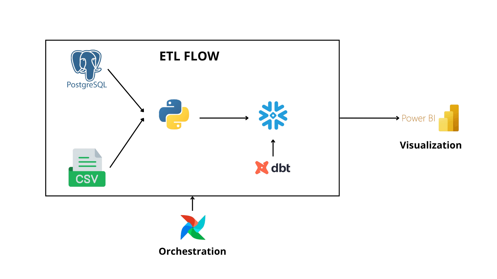
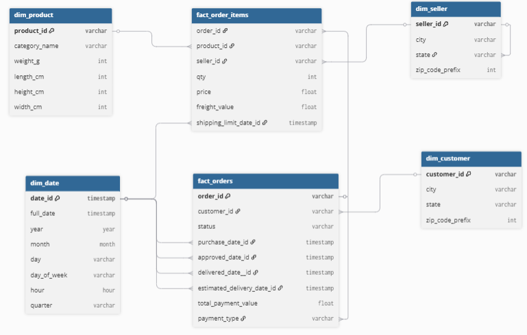

# Brazilian E-Commerce Data Pipeline & Analytics

# Project Overview

This project builds a **modern data pipeline and analytics system** for the [Brazilian E-Commerce Dataset (Olist)](https://www.kaggle.com/datasets/olistbr/brazilian-ecommerce)
. 
The goal is to **automate ETL workflows**, create a **data mart for business analytics**, and visualize key sales performance metrics using Power BI.

## ETL Architecture

## Components:
| Tool                      | Purpose                                     |
| ------------------------- | ------------------------------------------- |
| **PostgreSQL / CSV**      | Source data storage                         |
| **Python**                | Data extraction & transformation            |
| **Airflow (Astro CLI)**   | Workflow orchestration                      |
| **dbt (Data Build Tool)** | Data modeling & transformation in Snowflake |
| **Snowflake**             | Cloud data warehouse                        |
| **Power BI**              | Visualization & reporting                   |

## Data Mart Schema Design

### Fact Tables
* **fact_orders** → Order-level transaction data
* **fact_order_items** → Line-item level details for each order
### Dimension Tables
* **dim_customer** → Customer information
* **dim_seller** → Seller information
* **dim_product** → Product attributes
* **dim_date** → Date dimension for time-series analysis

## Business Metrics & Insights
This project includes two main **Power BI dashboards** designed to deliver actionable insights for business decision-making.
The dashboards highlight how the transformed and warehouse-ready data can be utilized for both operational and strategic analysis.

## 1. Sales Overview Dashboard
Provides a comprehensive view of overall sales performance to understand revenue trends and customer behavior.  
**Business Metrics**
* Total Revenue
* Total Customers
* Total Orders
* Average Order Value (AOV)
 

**Key Insights**
* Monthly revenue growth trends
* Cities with the highest sales performance
* Top-selling product categories
* Customer segmentation by city or region

## 2. Product & Seller Insights Dashboard
Focuses on analyzing product and seller performance based on sales quantity and revenue contribution.
  

**Business Metrics**
* Top 10 Products by Revenue
* Top 10 Products by Quantity Sold
* Top 10 Sellers by Revenue
* Top 10 Sellers by Quantity Sold
 

**Key Insights**
* Identification of high-performing products and sellers
* Product contribution to overall revenue
* Sales distribution patterns by quantity sold

## Data Flow Steps
1. **Extract :**
    * Raw CSV data from Kaggle is loaded into PostgreSQL.
2. **Transform (Python + dbt):**
    * Data cleaning, joins, and aggregations done in dbt models (staging → mart layers).
    * dbt builds the fact and dimension tables in Snowflake.
3. **Load:**
    * Final data mart tables are loaded to Snowflake.
4. **Orchestrate:**
    * Airflow (via Astro CLI) manages scheduling for ETL + dbt runs.
5. **Visualize:**
    * Power BI connects directly to Snowflake for interactive dashboards.
## Tools & Technologies
* **Languages**: Python, SQL
* **Database**: PostgreSQL, Snowflake
* **Transformation**: dbt
* **Orchestration**: Apache Airflow (Astronomer Cosmos)
* **Visualization**: Power BI
* **Containerization**: Docker

## Future Improvements
Add customer retention & cohort analysis

Automate Power BI dataset refresh

Integrate Airbyte for data ingestion

Add data quality monitoring (Great Expectations / dbt tests)